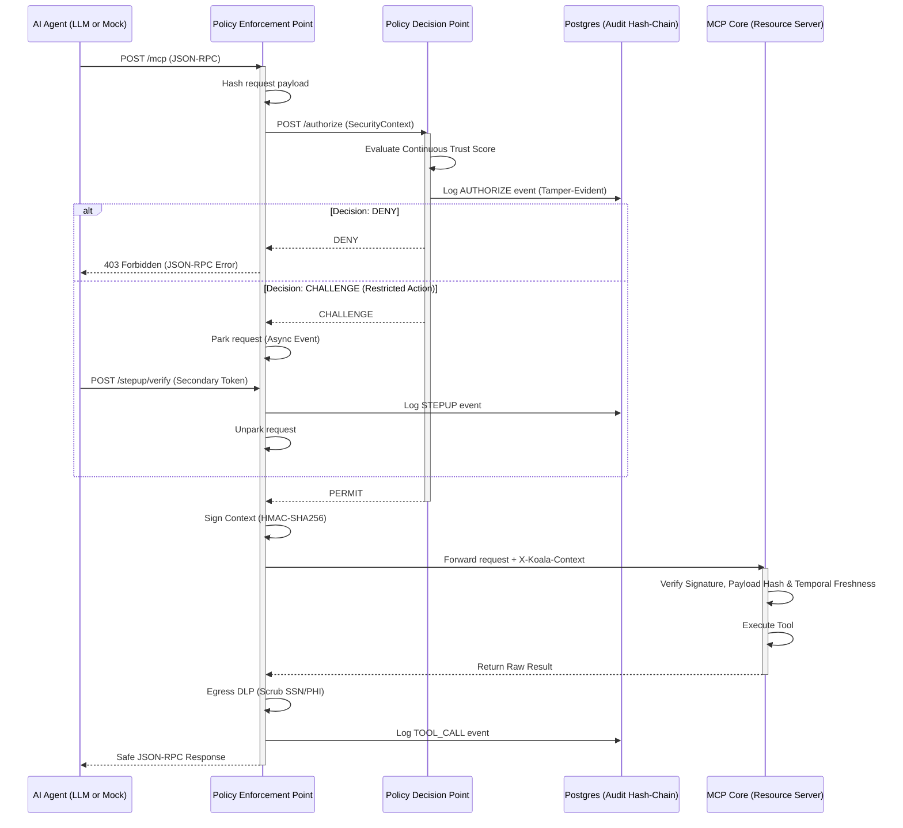

# Project Koala: Zero Trust for Healthcare MCP Agents 🐨🔒


## Project Overview

As autonomous AI agents increasingly interface with sensitive infrastructure via the Model Context Protocol (MCP), perimeter-based security is no longer sufficient. **Project Koala** provides a mathematically rigorous **Zero Trust Architecture (ZTA)** wrapper for MCP servers, rigidly adhering to the **NIST SP 800-207** framework.

Designed for high-stakes healthcare environments, this implementation prevents compromised AI agents from exfiltrating Protected Health Information (PHI) or executing unauthorized clinical commands. It achieves this by decoupling policy enforcement from business logic, explicitly refusing network trust, and strictly verifying cryptographic provenance for every single remote procedure call.

---

## Architectural Flow

Project Koala introduces a Policy Enforcement Point (PEP) and a Policy Decision Point (PDP) that intercept and evaluate all MCP traffic before it ever reaches the MCP Core.



---

## The Healthcare Demo Scenario

The MCP Core exposes a clinical-decision assistant with three distinct tools mapped to progressive resource tiers:

1. `get_drug_interactions` **(Public Tier)**: Queries a mock formulary. Security: Allowed by default.
2. `get_patient_record` **(Internal Tier)**: Retrieves patient history. Security: Triggers **Egress DLP**. PEP automatically replaces SSNs with `[REDACTED_SSN]` to prevent data exfiltration.
3. `prescribe_medication` **(Restricted Tier)**: State-modifying action. Security: Triggers immediate **Step-Up Authentication**. The agent must provide a secondary token before the request is signed and forwarded.

---

## Core Zero Trust Features

*   **Cryptographic Context Sealing:** PEP locks request metadata and SHA-256 payload hashes inside an HMAC-SHA256 envelope. MCP Core fails closed if signatures are missing or stale.
*   **Continuous Trust Evaluation (CARTA):** PDP uses a sliding-window rate-limiter as a trust scorer. Anomalous request volumes drop the subject's score, triggering `CHALLENGE` or `DENY`.
*   **Asynchronous Step-Up Authentication:** PEP suspends in-flight requests (Asyncio parking) when challenged, resuming only after a valid `/stepup/verify` call.
*   **Tamper-Evident Audit Logging:** Chained PostgreSQL logs (`record_hash = sha256(prev_hash || payload)`) ensure mathematical audit integrity.
*   **Egress Data Loss Prevention (DLP):** Real-time outbound scrubbing of sensitive patterns (SSNs) at the PEP layer.

---

## New: Local LLM Agent (ReAct)

This branch introduces a sophisticated **Local LLM Agent** (`agents/llm_agent.py`) that acts as the "untrusted" client.
- **Provider-Agnostic**: Supports **Ollama** (default: `gemma3:4b`) or OpenAI.
- **ReAct Implementation**: Dynamically discovers MCP tools and reason-act loops to solve medical prompts.
- **ZTA Awareness**: The LLM is system-prompted to handle redacted PHI and is "aware" of the PEP's security boundaries.
- **Auto-Step-Up**: The agent script handles back-channel token verification to transparently satisfy security challenges.

---

## Quick Start / Setup

Project Koala is completely containerized.

1.  **Ensure Prerequisites:**
    - Docker & Docker Compose.
    - **Ollama** (if using local LLM): `ollama pull gemma3:4b`
2.  **Spin up the Infrastructure:**
    ```bash
    docker-compose up --build -d
    ```
    *The PEP (8000) is exposed; PDP (8181) and Core (8080) are isolated.*

---

## Running the Demo

### 1. Interactive LLM Agent (Recommended)
Launch the ReAct agent and chat with the clinical assistant:
```bash
python agents/llm_agent.py
```
**Try these prompts:**
- *"Is there an interaction between aspirin and warfarin?"* (Public Tool)
- *"Show me the medical record for patient P001."* (Internal Tool + **DLP Scrubbing**)
- *"Prescribe 500mg Amoxicillin for P001."* (Restricted Tool + **Step-Up Challenge**)

### 2. Canned Scenarios
Execute automated demo flows:
```bash
python agents/llm_agent.py --scenario a|b|c|d|all
```
- `a`: Public access.
- `b`: DLP verification.
- `c`: Step-up authentication flow.
- `d`: Stress test (triggers Rate-Limit DENY).

### 3. Lightweight Mock Agent
For quick protocol verification without an LLM:
```bash
python agents/mock_agent.py
```

---

## The Team

Built for the 3rd-year B.Tech Cybersecurity curriculum at **Amrita Vishwa Vidyapeetham**:

*   **Anirudh** — Lead / Architecture
*   **Keerthan KK** — Developer
*   **Aaron Mathews** — Developer
