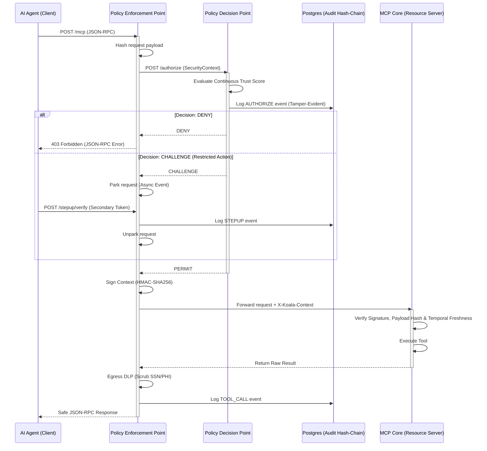

# Project Koala: Zero Trust for Healthcare MCP Agents 🐨🔒


## Project Overview

As autonomous AI agents increasingly interface with sensitive infrastructure via the Model Context Protocol (MCP), perimeter-based security is no longer sufficient. **Project Koala** provides a mathematically rigorous **Zero Trust Architecture (ZTA)** wrapper for MCP servers, rigidly adhering to the **NIST SP 800-207** framework.

Designed for high-stakes healthcare environments, this implementation prevents compromised AI agents from exfiltrating Protected Health Information (PHI) or executing unauthorized clinical commands. It achieves this by decoupling policy enforcement from business logic, explicitly refusing network trust, and strictly verifying cryptographic provenance for every single remote procedure call.

---

## Architectural Flow

Project Koala introduces a Policy Enforcement Point (PEP) and a Policy Decision Point (PDP) that intercept and evaluate all MCP traffic before it ever reaches the MCP Core.



---

## The Healthcare Demo Scenario

To demonstrate the architecture, the MCP Core exposes a mock clinical-decision assistant with three distinct tools mapped to progressive resource tiers:

1. `get_drug_interactions` **(Public Tier)**
   * **Action:** Queries a mock formulary for drug interactions.
   * **Security:** Allowed by default, assuming the agent's continuous trust score has not dipped due to rate-limit violations.
2. `get_patient_record` **(Internal Tier)**
   * **Action:** Retrieves patient demographics and medical history.
   * **Security:** Contains highly sensitive PHI (SSNs). On the return path, the PEP's **Egress Data Loss Prevention (DLP)** engine automatically detects and replaces the SSN with `[REDACTED_SSN]` to prevent the agent from absorbing or leaking the data.
3. `prescribe_medication` **(Restricted Tier)**
   * **Action:** A state-modifying write action to a patient's chart.
   * **Security:** Triggers an immediate **Step-Up Authentication** challenge. The PEP parks the in-flight request and forces the agent to supply a secondary verification token before the cryptographic seal is generated.

---

## Core Zero Trust Features

*   **Cryptographic Context Sealing:** The PEP locks the request metadata and a SHA-256 hash of the payload inside an HMAC-SHA256 envelope. The MCP Core strictly fails closed, completely rejecting traffic lacking a valid signature, mismatched payload hash, or stale timestamp (defending against Replay Attacks and network bypass).
*   **Continuous Trust Evaluation (CARTA):** The PDP features a sliding-window rate-limiter that acts as a continuous trust scorer. A subject's trust score dynamically drops upon anomalous request volumes, downgrading their access from `PERMIT` to `CHALLENGE` or `DENY`.
*   **Asynchronous Step-Up Authentication:** When the PDP returns `CHALLENGE`, the PEP safely suspends the asyncio coroutine without dropping the connection or leaking memory. The request only resumes when an out-of-band `/stepup/verify` call provides a valid token.
*   **Tamper-Evident Audit Logging:** Every terminal security decision is recorded in PostgreSQL. Each row is bound to the previous row via `record_hash = sha256(prev_hash || payload)`. Postgres advisory locks serialize concurrent writes across instances, ensuring the chain is mathematically unbroken and immune to silent database tampering.
*   **Egress Data Loss Prevention (DLP):** Outbound payload scrubbing prevents the MCP Core from accidentally leaking protected data to the untrusted agent network.

---

## Quick Start / Setup

Project Koala is completely containerized. The `docker-compose.yml` orchestrates the PostgreSQL database, the PDP, the PEP, and the MCP Core on an isolated internal network.

1. Ensure you have Docker and Docker Compose installed.
2. Clone the repository and navigate to the project root:
   ```bash
   cd Koala
   ```
3. Spin up the cluster:
   ```bash
   docker-compose up --build
   ```
   *The PEP is exposed on port `8000`. The MCP Core (`8080`) and PDP (`8181`) are isolated to the Docker bridge network and inaccessible from the host.*

---

## Running the Demo

To observe the Zero Trust protections in real-time, execute the mock agent script against the running cluster:

```bash
python agents/mock_agent.py
```

**What you will see:**
1. A baseline `initialize` handshake.
2. Successful execution of the Public `get_drug_interactions` tool.
3. A call to the Internal `get_patient_record` tool, where the SSN is visibly scrubbed out of the JSON response by the PEP DLP engine.
4. A call to the Restricted `prescribe_medication` tool. You will see the agent receive a `CHALLENGE` exception, execute an automated `/stepup/verify` request, and subsequently succeed.
5. Rate-limiting exhaustion, where rapid subsequent requests dynamically drop the agent's trust score until it reaches a terminal `DENY`.

*All logs are securely chained in the `koala_audit` Postgres database.*

---

## The Team

Built for the 3rd-year B.Tech Cybersecurity curriculum at **Amrita Vishwa Vidyapeetham**:

*   **Anirudh** — Lead / Architecture
*   **Keerthan KK** — Developer
*   **Aaron Mathews** — Developer
